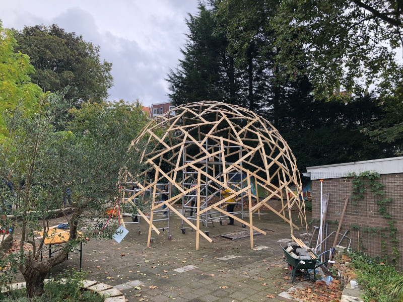

# Davinci Dome

This is a [React](https://reactjs.org/) project which is to enable the design of [Da Vinci](https://en.wikipedia.org/wiki/Leonardo_da_Vinci) Dome.

The project was initiated by [Joël Keijnemans](https://www.linkedin.com/in/jo%C3%ABl-keijnemans-07235820/) after completing the construction of the dome pictured above.

The goal is to simplify and accelerate the generic design of such domes with respect to size and complexity.

